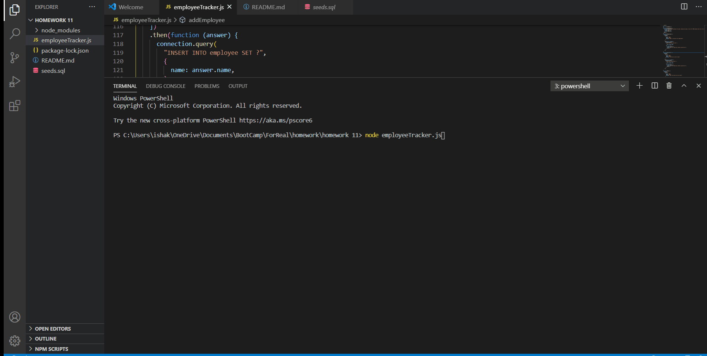

# Employee Tracker 
  This application is a command line application that keeps track of employees, their roles, as well as the department. With this app new infomation can be viewed, added, and updated.
  ## Table of Contents
  * [Installation](#Installation)
  * [Demo](#demo)
  * [Contributors](#contributors)
  * [Questions](#questions)
   ## Installation 
  Clone repository from GitHub.
  ## Demo
 
  ## Contributors
  Isha Khosla is the primary author. They recieved help from Simon Rennocks.
  ## Questions 
  If you have any questions, I can be found on github at ishakhosla131, or emailed at ishakhosla131@gmail.com.
 
